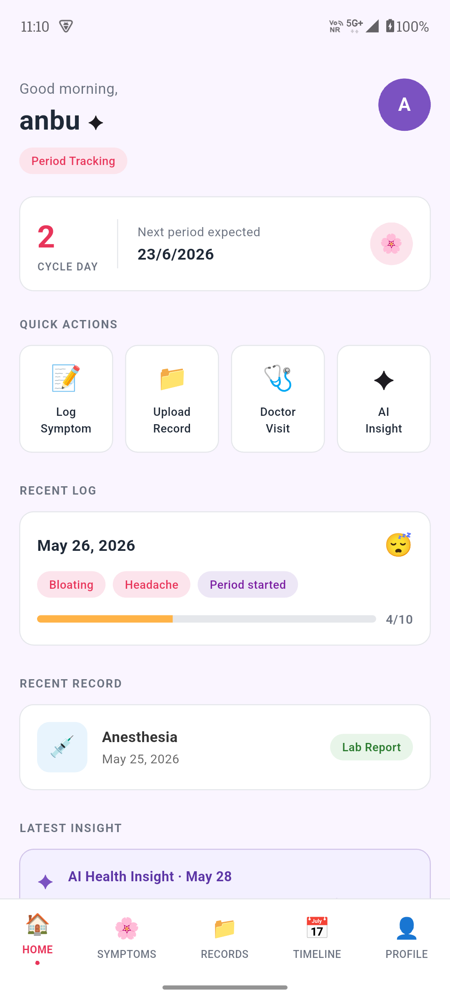
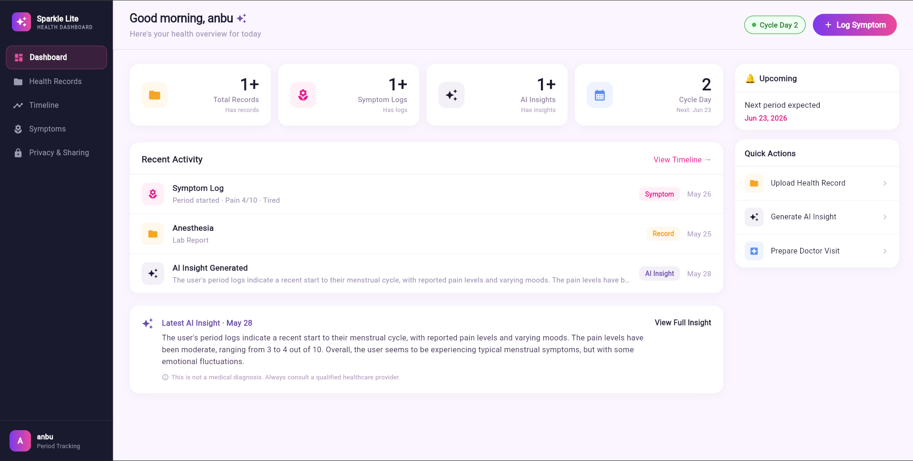
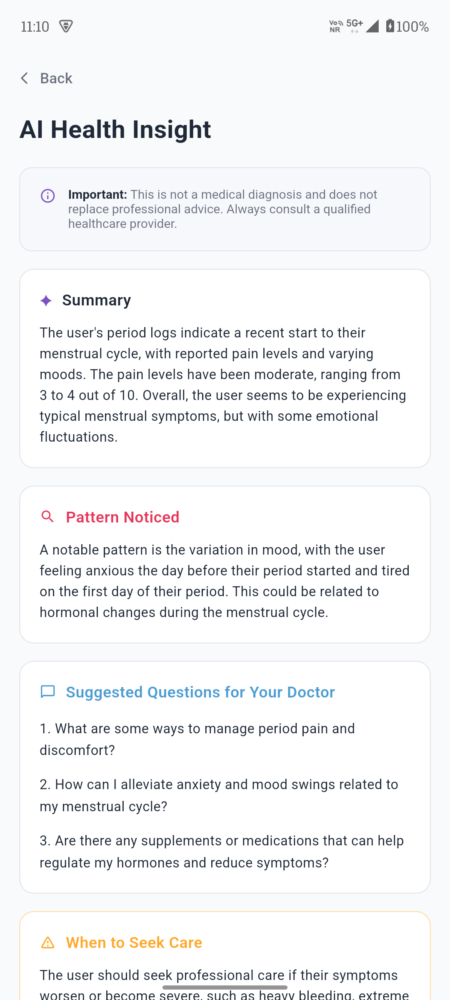
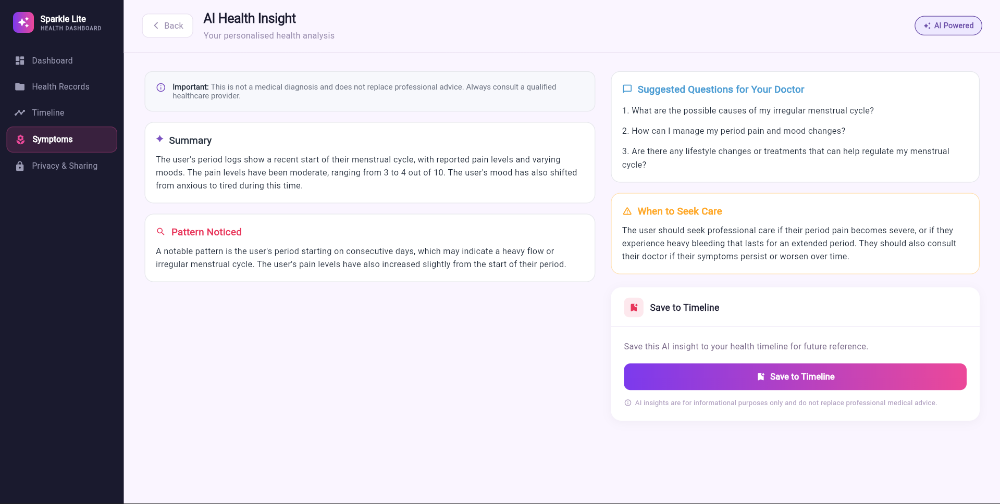

# Sparkle Lite 🌸

> **Your private health companion** — a cross-platform Flutter application for menstrual health tracking, symptom logging, AI-powered cycle insights, and health record management.

---

## Table of Contents

1. [Project Overview](#1-project-overview)
2. [Tech Stack](#2-tech-stack)
3. [Flutter Version](#3-flutter-version)
4. [Setup Instructions](#4-setup-instructions)
5. [Firebase Setup](#5-firebase-setup)
6. [How to Run — Mobile](#6-how-to-run--mobile)
7. [How to Run — Web](#7-how-to-run--web)
8. [How to Run Tests](#8-how-to-run-tests)
9. [Architecture](#9-architecture)
10. [State Management](#10-state-management)
11. [Data Model](#11-data-model)
12. [Known Limitations](#12-known-limitations)
13. [Future Improvements](#13-future-improvements)
14. [Screenshots](#14-screenshots)

---

## 1. Project Overview

**Sparkle Lite** is a Flutter application designed to help users track their menstrual health privately and intelligently. Core capabilities include:

- **Authentication** — Email/password sign-up and login via Firebase Auth, with a session gate that routes users through onboarding or directly to the home screen based on profile completion.
- **Symptom Logging** — Users log daily period status, flow level, pain level (0–10), mood, and freeform symptoms with optional notes.
- **Health Records** — Upload and manage health documents (lab reports, prescriptions, etc.) stored in Firestore.
- **AI Insights** — Select recent symptom logs and generate an AI-powered health summary that surfaces patterns, suggested questions for a doctor, and when to seek care. Insights are powered by the Groq API via Dio HTTP and persisted to the user's timeline.
- **Doctor Visit Tracker** — Log upcoming doctor visits; the home screen surfaces the next appointment as a reminder.
- **Timeline** — A chronological feed of all health events (symptoms, records, AI insights, doctor visits) with filter support.
- **Profile & Settings** — Multi-step profile setup capturing cycle details; privacy settings; family member profiles.
- **Network Awareness** — A global network listener detects connectivity changes and shows an offline page when the device has no connection.
- **Push Notifications** — Firebase Cloud Messaging integration for health reminders.

---

## 2. Tech Stack

| Layer | Technology |
|---|---|
| Framework | Flutter (Dart) |
| Authentication | Firebase Authentication |
| Database | Cloud Firestore |
| AI / Insights | Groq API via Dio HTTP |
| Push Notifications | Firebase Cloud Messaging + flutter_local_notifications |
| State Management | flutter_bloc (BLoC pattern) |
| Dependency Injection | get_it + injectable (LazySingleton) |
| Navigation / Routing | auto_route |
| HTTP Client | Dio |
| Connectivity | connectivity_plus |
| Local Storage | shared_preferences + flutter_secure_storage |
| Animations | Lottie |
| SVG Rendering | flutter_svg |
| File Picking | file_picker |
| Sharing | share_plus |
| Environment Config | flutter_dotenv |
| Code Generation | build_runner (injectable_generator, auto_route_generator) |

---

## 3. Flutter Version

```
Flutter 3.41.4 • channel stable
Framework • revision ff37bef603 • 2026-03-03
Engine • hash 99578ad0355d
Dart 3.11.1 • DevTools 2.54.1
```

---

## 4. Setup Instructions

### Prerequisites

- Flutter 3.41.4 (stable channel)
- Dart 3.11.1
- Android Studio / Xcode (for mobile targets)
- A Firebase project (see [Section 5](#5-firebase-setup))
- A `.env` file in the project root (see below)

### Steps

```bash
# 1. Clone the repository
git clone https://github.com/amrith-i/sparkle_lite.git
cd sparkle_lite

# 2. Install dependencies
flutter pub get

# 3. Create the environment file
cp .env.example .env
# Fill in the required values (see Environment Variables below)

# 4. Run code generation (routes + injection)
dart run build_runner build --delete-conflicting-outputs
```

### Environment Variables (`.env`)

```env
# Groq API
GROQ_API_KEY=your_groq_api_key_here

# App environment
APP_ENV=development
ENABLE_LOGS=true
ENABLE_CRASHLYTICS=false
BASE_URL=
SOCKET_URL=
```

---

## 5. Firebase Setup

### Step 1 — Create a Firebase project

1. Go to [https://console.firebase.google.com](https://console.firebase.google.com) and create a new project named **Sparkle Lite**.
2. Enable **Google Analytics** (optional).

### Step 2 — Enable Firebase services

Inside your Firebase project:

- **Authentication** → Sign-in method → Enable **Email/Password**.
- **Firestore Database** → Create database → Start in **production mode** → choose your region.
- **Cloud Messaging** → No manual step needed; it is enabled by default.

### Step 3 — Register your apps

#### Android
1. Register app with package name (e.g. `com.example.sparkle_lite`).
2. Download `google-services.json` → place it at `android/app/google-services.json`.

#### iOS
1. Register app with bundle ID (e.g. `com.example.sparkleLite`).
2. Download `GoogleService-Info.plist` → place it at `ios/Runner/GoogleService-Info.plist`.

#### Web
1. Register a Web app in Firebase console.
2. Copy the Firebase config object into `lib/firebase_options.dart` (or regenerate via FlutterFire CLI — see below).

### Step 4 — Generate `firebase_options.dart` (recommended)

```bash
# Install FlutterFire CLI
dart pub global activate flutterfire_cli

# Configure — this regenerates lib/firebase_options.dart automatically
flutterfire configure
```

### Step 5 — Firestore Security Rules

Deploy the following base rules to protect user data:

```firestore
rules_version = '2';
service cloud.firestore {
  match /databases/{database}/documents {

    // Users collection
    match /users/{uid} {
      allow read, write: if request.auth != null && request.auth.uid == uid;

      match /{subcollection}/{docId} {
        allow read, write: if request.auth != null && request.auth.uid == uid;
      }
    }

    // Profiles collection
    match /profiles/{uid} {
      allow read, write: if request.auth != null && request.auth.uid == uid;
    }
  }
}
```

### Firestore Collections

The app uses the following top-level and subcollection structure:

```
users/{uid}/
  symptom_logs/{logId}
  health_records/{recordId}
  insights/{insightId}
  doctor_visits/{visitId}
  timeline/{itemId}

profiles/{uid}
```

---

## 6. How to Run — Mobile

```bash
# List connected devices
flutter devices

# Run on a connected Android or iOS device
flutter run

# Run on a specific device
flutter run -d <device-id>

# Run a release build (Android)
flutter run --release

# Build APK
flutter build apk --release

# Build iOS (requires macOS + Xcode)
flutter build ios --release
```

---

## 7. How to Run — Web

```bash
# Run on Chrome (development)
flutter run -d chrome

# Run on Chrome with a specific port
flutter run -d chrome --web-port=8080

# Build for web (production)
flutter build web --release
```

> **Note:** Push notifications (FCM) are not fully supported on the web target. The `PushNotificationService` is guarded by platform checks to prevent crashes on web.

---

## 8. How to Run Tests

```bash
# Run unit tests
flutter test test/unit_test.dart

# Run widget tests
flutter test test/widget_test.dart

# Run all tests
flutter test

# Run tests with coverage
flutter test --coverage
```

---

## 9. Architecture

Sparkle Lite follows **Clean Architecture** with a strict separation into three layers per feature. Each feature is self-contained under `lib/features/<feature_name>/`.

```
lib/
├── app/                        # App entry: AppRoot, MyApp, app.dart
├── config/
│   ├── constants/              # Global colors, text styles, icons, paddings
│   ├── env/                    # AppConfig, EnvResolver, .env loading
│   ├── injection/              # GetIt configuration + generated injection config
│   └── routes/                 # AppRouter (auto_route) + generated .gr.dart
├── core/
│   ├── bootstrap/              # AppBootstrapper — initialises services at startup
│   ├── common/                 # Shared pages, widgets, enums
│   ├── di/                     # FirebaseModule (GetIt bindings for Firebase instances)
│   ├── error/                  # ErrorHandler, ApiFailure
│   ├── extensions/             # ScalingExtensions (responsive helpers)
│   ├── networks/               # ApiResult<T>, BaseRepository, NetworkChecker
│   ├── responsive/             # ScreenScaler, ResponsiveContext
│   ├── services/               # NetworkListenerService, PushNotificationService
│   ├── session/                # SessionBloc, UserSessionModel, UserSessionStorage
│   ├── theme/                  # Per-feature theme tokens (colors, decorations, text styles)
│   └── usecase/                # BaseUsecase<P, R>
├── features/
│   ├── auth/                   # Login, Sign-up
│   ├── home/                   # Dashboard, Add Symptom, Upload Record,
│   │                           # Doctor Visit, AI Insight flow
│   ├── onboarding/             # First-run slides + completion flag
│   ├── profile/                # Multi-step profile setup
│   ├── profile_settings/       # Settings page, privacy, family members
│   ├── records/                # Health records list + delete
│   ├── symptom/                # Symptom log list + delete + filter
│   └── timeline/               # Chronological health timeline + filter
└── core_import.dart            # Barrel file — re-exports all packages & layers
```

### Per-feature layer breakdown

```
feature_name/
├── data/
│   ├── datasources/   # Remote data source interface + LazySingleton implementation
│   ├── dto/           # Data Transfer Objects (Firestore ↔ Dart)
│   └── repositories/  # Repository implementation (wraps datasource, maps DTOs to entities)
├── domain/
│   ├── entities/      # Pure Dart business objects (no Firebase imports)
│   ├── repositories/  # Abstract repository contracts
│   └── usecases/      # One class per action; all extend BaseUsecase<Params, Result>
└── presentation/
    ├── bloc/          # BLoC: events, states, handler methods
    ├── pages/         # @RoutePage()-annotated full-screen widgets
    └── widgets/       # Reusable sub-widgets scoped to this feature
```

### Routing

Navigation is handled entirely by **auto_route**. The root route is `SessionGatePage`, which acts as a splash screen and guards routing:

- No Firebase user → `LoginRoute`
- Firebase user + Firestore profile exists → `HomeRoute` (inside `MainShellRoute`)
- Firebase user, no profile → `LoginRoute` (login page triggers onboarding flow)

The main shell (`MainShellRoute`) hosts a bottom navigation bar with five tabs: Home, Symptoms, Records, Timeline, and Profile.

---

## 10. State Management

The app uses **flutter_bloc** (BLoC pattern) throughout. This separate the business logic from other functionalities to keep it clean.

### Pattern

Every feature that has user-driven state owns a dedicated `Bloc` subclass:

```
FeatureBloc        extends Bloc<FeatureEvent, FeatureState>
FeatureEvent       — sealed/abstract; one subclass per user action
FeatureState       — sealed/abstract; subclasses represent loading/success/failure/initial
```

### Dependency injection of BLoCs

All BLoCs are annotated with `@injectable` and resolved via `getIt`. They are provided to the widget tree using `BlocProvider` at the page level, so each page creates and owns its own BLoC instance.

### Example flow — AI Insight generation

```
User taps "Generate Insight"
  → HomeBloc receives GenerateAiInsight event
  → emits AiInsightGenerating (shows loading page)
  → GenerateAiInsightUsecase calls HomeRemoteDataSource
  → DataSource calls Groq API (via Dio) with a formatted symptom prompt
  → Response parsed into AiInsightDto → mapped to AiInsightEntity
  → HomeBloc emits AiInsightGenerated(entity)
  → AiInsightResultPage renders the insight cards
  → User taps "Save to Timeline"
  → HomeBloc receives SaveInsightToTimeline → emits InsightSavedToTimeline
```

### Global state

`SessionBloc` is provided at the root (`AppRoot`) level and tracks authentication state across the app lifetime. It listens to `FirebaseAuth.authStateChanges()` and emits `SessionAuthenticated` / `SessionUnauthenticated`.

---

## 11. Data Model

All data exchange between Firestore and the domain layer goes through **DTO classes** in `data/dto/`. Each DTO follows a consistent contract:

| Method | Purpose |
|---|---|
| `fromFirestore(Map, id)` | Deserialise a Firestore document snapshot |
| `toFirestore()` | Serialise for **creating** a new document (includes `createdAt: serverTimestamp()`) |
| `toFirestoreForUpdate()` | Serialise for **updating** an existing document (adds `updatedAt`, uses `FieldValue.delete()` for nulled optional fields, never overwrites `createdAt`) |
| `toEntity()` | Convert to a pure domain entity |
| `fromEntity(entity)` | Convert from a domain entity (used on write path) |

### Key models

#### SymptomLog

Stored at `users/{uid}/symptom_logs/{logId}`.

| Field | Type | Description |
|---|---|---|
| `date` | `Timestamp` | The date the symptom was recorded |
| `periodStatus` | `String` | e.g. `"on_period"`, `"spotting"`, `"off_period"` |
| `flowLevel` | `String` | e.g. `"light"`, `"medium"`, `"heavy"` |
| `painLevel` | `int` | 0–10 numeric scale |
| `mood` | `String` | e.g. `"happy"`, `"anxious"`, `"tired"` |
| `symptoms` | `List<String>` | Array of symptom tags |
| `notes` | `String?` | Optional freeform note |
| `createdAt` | `Timestamp` | Server timestamp on first write |
| `updatedAt` | `Timestamp` | Server timestamp on subsequent writes |

#### AiInsight

Stored at `users/{uid}/insights/{insightId}`.

| Field | Type | Description |
|---|---|---|
| `summary` | `String` | Plain-language health summary from Claude |
| `patternNoticed` | `String` | Detected pattern across selected logs |
| `suggestedQuestions` | `List<String>` | Questions to ask a doctor |
| `whenToSeekCare` | `String` | Guidance on urgency |
| `generatedDate` | `Timestamp` | When the insight was generated |
| `logIds` | `List<String>` | IDs of the symptom logs used as input |
| `createdAt` | `Timestamp` | Server timestamp |

#### HealthRecord

Stored at `users/{uid}/health_records/{recordId}`.

| Field | Type | Description |
|---|---|---|
| `title` | `String` | Document title |
| `type` | `String` | e.g. `"lab_report"`, `"prescription"` |
| `date` | `Timestamp` | Date of the record |
| `fileUrl` | `String?` | URL of the uploaded file (if any) |
| `notes` | `String?` | Optional notes |
| `createdAt` | `Timestamp` | Server timestamp |

#### UserProfile

Stored at `profiles/{uid}`.

| Field | Type | Description |
|---|---|---|
| `name` | `String` | Display name |
| `dateOfBirth` | `Timestamp?` | Used for age-related insights |
| `cycleLength` | `int` | Average cycle length in days |
| `periodLength` | `int` | Average period duration in days |
| `lastPeriodDate` | `Timestamp?` | Used to compute cycle day on home screen |

---

## 12. Known Limitations

- **Web push notifications** — Firebase Cloud Messaging requires a service worker on web. The current implementation skips FCM initialisation on web; local notifications are not shown on web targets.
- **File upload** — Health records currently capture metadata and a local file reference via `file_picker`. There is no Firebase Storage integration for actual file upload; `fileUrl` is not persisted to Firestore in the current version.
- **AI Insight rate limiting** — The Groq API call is made directly from the client via Dio 
with an API key stored in `.env`. There is no server-side rate limiting or key protection. In production this should be proxied through a backend.
- **No real-time listeners** — Firestore data is fetched on demand (single reads), not via `snapshots()` streams. Changes made on another device are not reflected until the user manually refreshes.
- **Session model fields** — `UserSessionModel` carries several legacy fields (`outletId`, `outletName`, `driverId`, `role`, `roleName`) that are left over from a prior project scaffold and are not used in this app.
- **Test coverage** — Unit and widget tests exist but coverage is minimal; the AI insight pipeline and BLoC handlers lack comprehensive test cases.
- **No pagination** — Symptom logs and health records are fetched in their entirety. For users with large data sets this will become slow and costly.
- **Hardcoded English locale** — There is no i18n/l10n support; all strings are hardcoded in English.
- **No dark mode** — The theme system uses fixed light-mode colour tokens; there is no `ThemeMode` toggle.

---

## 13. Future Improvements

### High priority

- **Backend proxy for AI calls** — Move the Claude API call to a Firebase Cloud Function or a dedicated backend to protect the API key, add rate limiting per user, and enable server-side caching of insight responses.
- **Firebase Storage for file uploads** — Integrate `firebase_storage` so health record files are actually uploaded and accessible via a persistent URL.
- **Real-time Firestore streams** — Replace one-shot `get()` calls with `snapshots()` streams on the home screen and timeline so the UI updates automatically across devices.
- **Pagination** — Implement cursor-based pagination for symptom logs, records, and timeline using Firestore `startAfterDocument`.

### UI / UX

- **Interactive cycle calendar** — A monthly calendar view that colour-codes days by period status, making it easy to spot cycle patterns at a glance.
- **Mood and symptom trend charts** — Line/bar charts (e.g. using `fl_chart`) showing pain level and mood trends over the last 30/60/90 days.
- **Dark mode** — Add a `ThemeMode` toggle and dark variants of all theme token files.
- **Animated transitions** — Use Hero animations and shared-axis transitions (Material motion) between the home cards and their detail pages.
- **Onboarding improvements** — Add an interactive cycle-length picker during onboarding so the home screen can immediately show an accurate cycle day count.

### Technical

- **i18n / l10n** — Add `flutter_localizations` and ARB files to support multiple languages.
- **Comprehensive test suite** — Add BLoC unit tests for every event/state transition, repository mock tests using `mocktail`, and golden tests for key widgets.
- **CI/CD pipeline** — GitHub Actions workflow to run `flutter analyze`, `flutter test`, and build release artifacts on every pull request.
- **Crashlytics** — The `enableCrashlytics` config flag exists but is not wired up; integrate `firebase_crashlytics` to capture production errors.
- **Accessibility** — Add `Semantics` labels to icon-only buttons, ensure minimum tap target sizes, and run `flutter test --accessibility`.
- **Clean up legacy session fields** — Remove unused fields (`outletId`, `driverId`, etc.) from `UserSessionModel` to reduce confusion.

---

## 14. Screenshots

_Screenshots added here._

```
screenshots/
├── mobile/
│   ├── splash.png
│   ├── login.png
│   ├── home.png
│   ├── add_symptom.png
│   ├── ai_insight_result.png
│   ├── timeline.png
│   └── profile_settings.png
└── web/
    ├── splash.png
    ├── login.png
    ├── home.png
    ├── add_symptom.png
    ├── ai_insight_result.png
    ├── timeline.png
    └── profile_settings.png
```

reference:

```md




```

---

## Project Structure Summary

```
sparkle_lite/
├── android/
├── ios/
├── web/
├── lib/
│   ├── app/
│   ├── config/
│   ├── core/
│   ├── features/
│   │   ├── auth/
│   │   ├── home/
│   │   ├── onboarding/
│   │   ├── profile/
│   │   ├── profile_settings/
│   │   ├── records/
│   │   ├── symptom/
│   │   └── timeline/
│   ├── firebase_options.dart
│   ├── core_import.dart
│   └── main.dart
├── test/
│   ├── unit_test.dart
│   └── widget_test.dart
├── .env
├── pubspec.yaml
└── README.md
```

---

*Built with Flutter 3.41.4 · Firebase · BLoC · AutoRoute · Clean Architecture*
